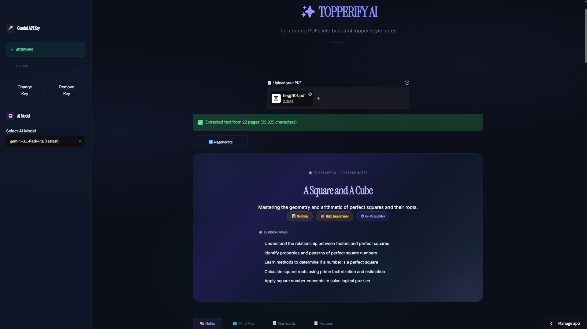
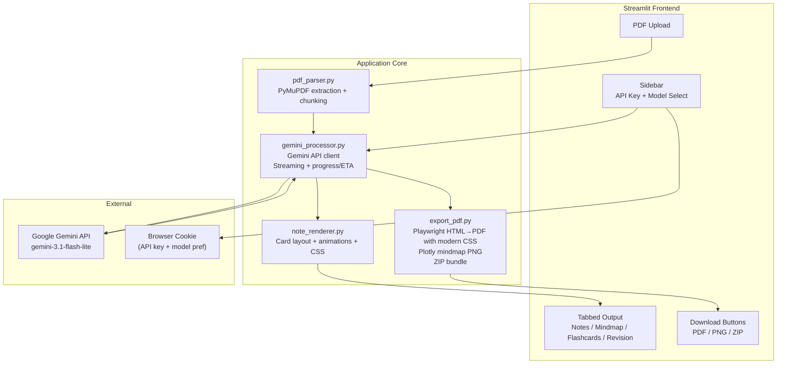

# Topperify AI



Turn any PDF into comprehensive, deeply detailed study notes. Upload a textbook chapter, research paper, or class notes, and get full-spectrum learning material with definitions, formulas, worked examples, mind maps, flashcards, and revision sheets - all beautifully rendered and downloadable.

## Features

- **Deep Learning** - AI generates thorough, research-rich content that explains concepts in depth, not just bullet points
- **Visual Notes** - Color-coded glassmorphism cards for definitions, concepts, formulas, examples, exam tips, memory tricks, and common mistakes
- **Interactive Mind Maps** - Visual hierarchy of topics for big-picture understanding
- **Flashcards** - Active recall cards for self-testing
- **Quick Revision Sheet** - Condensed reference with key definitions, facts, formulas, and questions
- **Modern PDF Export** - Beautiful glassmorphism-styled PDFs rendered with Chromium (Playwright) supporting modern CSS features like backdrop-filter, gradients, rounded corners, and custom web fonts
- **Multiple Export Formats** - Download individual PDFs (notes, flashcards, revision sheet), mind map PNG, or a single ZIP bundle with everything
- **Premium Dark UI** - Apple/Linear-inspired glassmorphism design with smooth animations
- **No Account Needed** - API key stored in your browser cookies, never on a server

## Architecture



- Python / Streamlit
- Google Gemini 3.1 Flash Lite (streaming, thinking mode)
- PyMuPDF (PDF text extraction)
- Playwright (Modern HTML/CSS to PDF with glassmorphism styling)
- Plotly + Kaleido (mind map image export)
- streamlit-agraph (interactive mind maps)
- extra-streamlit-components (cookie-based API key persistence)

## Project Structure

```
topperify_ai/
  streamlit_app.py          # Main entry - sidebar, upload, pipeline, tabs, export
  requirements.txt
  utils/
    pdf_parser.py           # PDF text extraction via PyMuPDF
    gemini_processor.py     # Gemini AI client with streaming + progress bar
    note_renderer.py        # All visual rendering (glass cards, animations, CSS)
    export_pdf.py           # Premium PDF/PNG/ZIP export module
```

## Quick Start

```bash
git clone https://github.com/programmersd21/topperify_ai.git
cd topperify_ai
python -m venv .venv
source .venv/bin/activate   # Windows: .venv\Scripts\activate
pip install -r requirements.txt
playwright install chromium  # Install Chromium browser for PDF rendering
streamlit run streamlit_app.py
```

1. Get a free Gemini API key from [Google AI Studio](https://aistudio.google.com/)
2. Open the app, enter your key in the sidebar
3. Upload a PDF and let the AI generate your study notes

## Deployment

### Streamlit Community Cloud

1. Push to GitHub
2. Deploy on [Streamlit Community Cloud](https://share.streamlit.io)
3. The repository includes a `packages.txt` file with all required Playwright system dependencies
4. Streamlit Cloud will automatically install Playwright browsers on deployment

### Local Development

After installing dependencies, run:
```bash
playwright install chromium
```

This downloads the Chromium browser needed for PDF rendering.

## Pre-existing Deployment

https://topperify.streamlit.app/

## License

MIT
